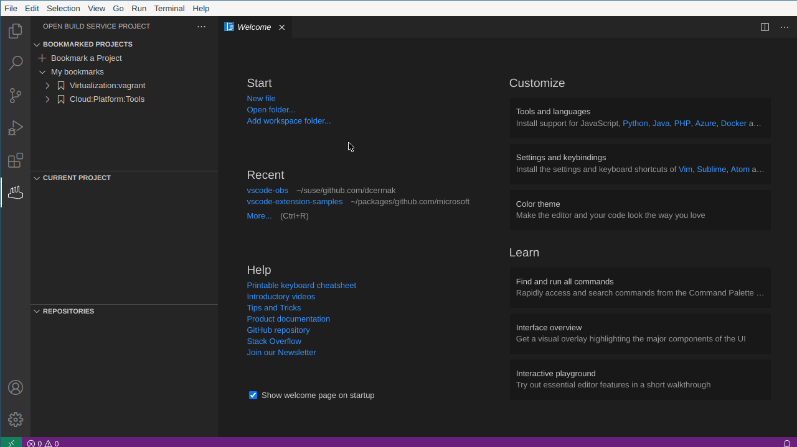
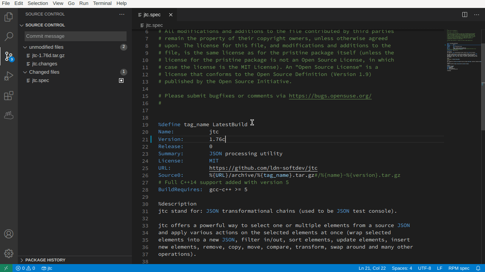

# Open Build Service Connector

[](https://marketplace.visualstudio.com/items?itemName=SUSE.open-build-service-connector)
[](https://travis-ci.org/SUSE/open-build-service-connector)
[](https://github.com/SUSE/open-build-service-connector/actions?query=workflow%3ACI)
[](https://github.com/SUSE/open-build-service-connector/actions?query=workflow%3A%22UI_tests%22)
[](https://github.com/SUSE/open-build-service-connector/blob/master/LICENSE)

Visual Studio Code extension for integration with the [Open Build
Service](https://openbuildservice.org/): it allows you to view existing packages
and project, check them out locally and integrates into VSCode's source
control.

**NOTE:** The extension is still in the Beta, thus exercise caution when using
it in production.


## Features

Be sure to checkout the unveiling talk at [SUSECON Digital
2020](https://www.susecon.com/sessions.html) (session id `DEV-1287`), which
includes a full live demo in the second half.

### Bookmark and view projects

You can bookmark projects from OBS so that they are directly accessible from
within VSCode by clicking on the `Bookmark a Project` entry in the `BOKMARKED
PROJECTS` view:


The interactive guide will prompt you for the name of the project and for the
packages that should be bookmarked:


You can browse the bookmarked projects, packages and their files. Clicking on a
file opens a read-only view of the file contents retrieved from the Open Build
Service.


### Checking out projects and packages

Packages (or whole projects) have to be checked locally out so that
modifications can be send back to the Open Build Service. They can be checked
out by clicking on the `repo-clone` icon on a Package or Project entry in the
Bookmarked Projects view or on the icon the upper right if a file from a package
is currently open:


Packages or Projects that are not bookmarked can be checked out by invoking the
command "Check out the project" or "Check out the package" command:




### Repository and Current Project view

The "Repositories" view shows the repositories of the project to which the
currently opened file belongs to. Similarly the "Current Project" view shows the
project to which the package belongs to:


New repositories can be added to a project by using clicking on the `+` in the
bar of the "Repositories" view:


Each repository can be expanded by clicking on it which reveals the paths and
architectures of the specific repository. Paths and architectures can be added
or removed via the `+` and `-` icons that appear next to the respective entries
in the tree view:


### Source control integration

Locally checked out packages are integrated into VSCode's source control and
provide the basic features:

- the fringe indicates whether lines were changed
- clicking on the fringe opens a `QuickDiff` view
- individual changes or all changes in a file can be reverted by clicking on the
  "discard" icon
- clicking on a modified file in the Source control menu opens a full diff of
  the respective file
- the "Package History" view shows the past commits of the current package


The modifications can be committed to the Open Build Service via the source
control input box. Optionally one can use the same input box to add an entry to
changelog:




## Requirements

You need an account on an instance of the Open Build Service
(e.g. https://build.opensuse.org/) to use this extension. If you don't have one,
you can sign up for an account on https://build.opensuse.org/
[here](https://idp-portal.suse.com/univention/self-service/#page=createaccount).


## Extension Settings

### `accounts`

Your account(s) are stored in the `settings.json` as follows:
```json
  "vscode-obs": [
    {
      "accountName": "Alias for this account",
      "apiUrl": "http://api.foo.com",
      "username": "myUserName",
      "realname": "YourRealName",
      "email": "your_email@provider.tld",
      "serverCaCertificate": "Paste a custom cert.pem in here if required"
    },
    {
      // another account here
    }
  ]
```

The only mandatory settings are `accountName`, `apiUrl` and `username`. Note
that the `apiUrl` is the url to the **API** of the Open Build Service instance,
which is not the same as the url to the web UI. For example on OBS the web UI is
accessible via [build.opensuse.org](https://build.opensuse.org), the API on the
other hand via [api.opensuse.org](https://api.opensuse.org).

Adding a `realname` and `email` is required to be able to add changelog entries,
but if you will not use that feature, then you needn't provide them. You can
also add a custom certificate to an account in case the specific instance uses a
certificate that is not in VSCode's certificate chain.

### `checkUnimportedAccounts`

The extension will check on launch whether there are accounts in your
`~/.config/osc/oscrc` that have not been imported already. You can disable this
check by setting this value to `false`.

### `logLevel`

Defines the log level that will be used. For most users `error` is a sensible
default as it will keep the size of the logfiles small. When submitting bug
reports, please set the loglevel to `trace` to receive a more complete log.

### `forceHttps`

The extension will by default reject accounts that use http for
communication. If your instance cannot use https, then you can set `forceHttps`
to false to permit http connections. **Caution:** your account password will be
transmitted in clear text then! Use this only for connections that are protected
by other means as well (e.g. local only or a VPN).


## Installation and setup

### Secret storage

Linux users have to install
[libsecret](https://wiki.gnome.org/Projects/Libsecret) for storing the account
passwords. The installation command will differ depending on your distribution:

- on openSUSE: `sudo zypper in libsecret`
- on Debian and Ubuntu: `sudo apt-get install libsecret-1-dev`
- on Fedora, RHEL and CentOS: `sudo dnf install libsecret`
- on Arch Linux: `sudo pacman -S libsecret`

Next install the `Open Build Service Connector` from the Visual Studio Code
Marketplace / the Extension menu.

Once the extension is installed, you need to configure your account(s). The
extension will automatically prompt you to import any accounts from your
`~/.config/osc/oscrc` in case you are already using
[osc](https://github.com/openSUSE/osc). Otherwise you can add your account
either to your `settings.json` or by invoking the command `Add an existing
account from the Open Build Service to the extension` which will guide you via
an interactive wizard. Once setup, you can always modify the general account
settings in your `settings.json` and change the account password via the command
`Set the password of a Build Service Account`.

MacOSX and Windows users don't have to install anything, as
[node-keytar](https://github.com/atom/node-keytar) uses the operating system's
secret storage.

## Current limitations

- Repositories can only be created from existing distributions and not
  completely manually.

- Checking out projects currently results in **all** packages being checked
  out.

Please also be sure to checkout the issue tracker!


## Credits

- [@hellcp](https://github.com/Hellcp) for the icon used in the Activity Bar
- [@hennevogel](https://github.com/hennevogel) for improving the mini OBS test
  setup
- [@adrianschroeter](https://github.com/adrianschroeter) for help with OBS' API
